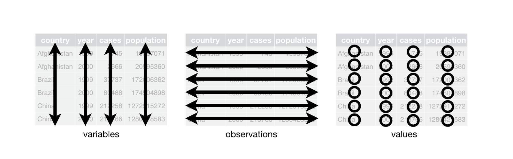
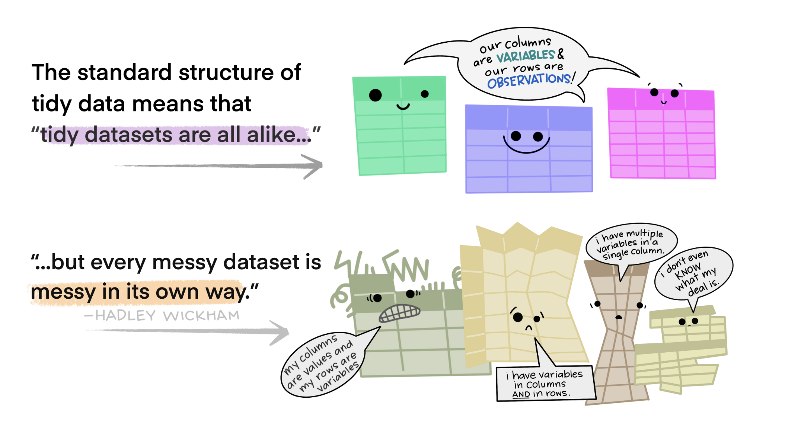

```{r setup, include=FALSE}
library(xaringanExtra)
library(RefManageR)
use_xaringan_extra(c("tile_view", "panelset", "share_again", "editable",
                     "clipboard", "progessbar"))
use_extra_styles(hover_code_line = TRUE,
                 mute_unhighlighted_code = FALSE)

options(htmltools.dir.version = FALSE,
        knitr.table.format = "html",
        knitr.kable.NA = "")
knitr::opts_chunk$set(warning = FALSE,
                      message = FALSE, fig.path = "figs/",
                      fig.width = 7.252, fig.height = 4,
                      comment = "#>",
                      fig.retina = 3)
old <- ggplot2::theme_set(iheiddown::theme_iheid())
```

class: split two

# What did we learn last week?

--

.pull-left[

Conceptually:

- What are objects?

- What are classes?

- What are data structures?


]

--

.pull-right[

Practically:

```{r echo=TRUE, eval=FALSE}
# <- the assign operator
# $  the extract operator
# == , !=, =<, >=  logical operators
# &, /, | conditions
# [1,3] brackets  
class()
dim() 
length() 
summary()
data.frame()
median()
mean()
subset()
ifelse()
grepl()
```


]

---

class: split two

# Homework for today

.pull-left[

*Let's start by going through the homework together!*

- Common issues

- Any other general questions?

]

.pull.right[


]

---

class: split two


.pull-left[

## Lecture:

  - Tidy verse and thinking
  
  - From untidy to tidy data
  
  - From tidy data to findings
]

.pull-right[

## Practical:

  - Cleaning data
  
  - Wrangling data
  
  - Joining data
]

---

class: split two

# Tidyverse? (1/2)

.pull-left[

The universe of tidiness?

From the [tidyverse](https://www.tidyverse.org/) website:

> The tidyverse is an opinionated **collection of R packages** designed for data science. All packages share an underlying design philosophy, grammar, and data structures.

]

.pull-right[


]

---

# Tidyverse? (2/2)

Installing and loading the tidyverse: *be careful!*

```{r, eval = FALSE}
install.packages("tidyverse")
library(tidyverse)
```

The tidyverse is actually *eight* different packages!


---

# Tidy data (1/4)

  - What is a tidy dataset?
  
    - Each column is one variable
    - Each row is one case/observation
    - Each cell stores one value
    


.fifty[Check: [Hadley Wickham’s dissertation paper that introduced tidy data.]( https://www.jstatsoft.org/article/view/v059i10)]

---

# Tidy data (2/4)

Is this tidy?

| Animal | Conversion  |
| --- | --- | 
| Domestic dog | 24.0 / 5.10 |
| Domestic cat | 30.0 / 4.08 |
| American alligator | 77.0 / 1.59 | 
| Golden hamster | 3.9 / 31.41 |
| King penguin | 26.0 /  4.71 |

--

No! Cells in the second column contain two values.

--

.fifty[Author: [Fabio Votta](https://github.com/favstats)]

---

# Tidy data (3/4)


Is this tidy?

| Animal | Type | Value  |
| --- | --- | --- | 
| Domestic dog | lifespan | 24.0 |
| Domestic dog | ratio | 5.10 |
| Domestic cat | lifespan | 30.0 |
| Domestic cat | ratio | 4.08 |
| American alligator | lifespan | 77.0 | 
| American alligator | ratio | 1.59 |

--

No! The second column contains two variables.

--

.fifty[Author: [Fabio Votta](https://github.com/favstats)]

---

# Tidy data (4/4)

One last example:

--

from untidy...

| country | 1999 | 2000  |
| --- | --- | --- | 
| Afghanistan | 19987071 | 20595360 |
| Brazil | 172006362 | 174504898 |

--

to tidy!

| country | year | population  |
| --- | --- | --- | 
| Afghanistan | 1999 | 19987071 |
| Afghanistan | 2000 | 20595360 |
| Brazil | 1999 | 172006362 |
| Brazil | 2000 | 174504898 |

---

class: split two

# Tidying (1/6)


.pull-left[

[tidyr](https://github.com/rstudio/cheatsheets/blob/main/tidyr.pdf) can help getting from untidy to tidy data in R!

]

.pull-right[


]

- `separate()` separates data by tidying columns with two variables or values (`unite()` does the opposite.)

- `pivot_wider()` pivots data by tidying columns with more than one variable.

- `pivot_longer()` pivots data by tidying rows that contain variables.
  
Let's see how this works in the following slides...

---

# Tidying (2/6)

Is this tidy or untidy data?

```{r}
untidy_population <- data.frame("Country" = c("Afghanistan-middle east",
                                            "Brazil-south america",
                                            "China-eastern asia"),
                                "year_1999" = c(19987071, 172006362, 1272915272),
                                "year_2000" = c(20595360, 174504898, 1280428583))
untidy_population
```

--

How to make this data tidy?

---

# Tidying (3/6)

Let's `separate()` columns

```{r, eval=FALSE}
library(tidyr)
tidy_population <- separate(untidy_population, Country,
                            sep="-", into=c("country", "region"))
tidy_population
```

--

```{r, echo=FALSE}
library(tidyr)
tidy_population <- separate(untidy_population, Country,
                            sep="-", into=c("country", "region"))
tidy_population
```

--

What else could we do to make this even tidier?

---

# Tidying (4/6)

Let's pivot the data long

- `pivot_longer()` pivots  data by tidying rows that contain variables (i.e. means more observations, a *longer* dataset)

--

```{r, eval=FALSE}
pivot_longer(tidy_population,
             cols = c("year_1999","year_2000"),
             names_to = "year",
             values_to = "population")
```

--

```{r, echo=FALSE}
pivot_longer(tidy_population,
             cols = c("year_1999","year_2000"),
             names_to = "year",
             values_to = "population")
```

---

# Tidying (5/6)

Another untidy example

```{r}
untidy_burgers <- data.frame(Lecturer = c("Henrique", "Livio",
                                          "Henrique", "Livio",
                                          "Henrique", "Livio"),
                             Burger_joint = c("Inglewoods", "Inglewoods",
                                              "H. Foundation", "H. Foundation",
                                              "Holy Cow", "Holy Cow"),
                             Grade = c(7, 10, 5, 5, 9, 7))
untidy_burgers
```

How to make this data tidier?

---

# Tidying (6/6)

Let's pivot this data wide

- `pivot_wider()` pivots data by tidying columns with more than one variable (i.e. this means more variables, a *wider* dataset)

--

```{r, eval=FALSE}
pivot_wider(untidy_burgers,
            names_from = Burger_joint,
            values_from = Grade)
```

--

```{r, echo=FALSE}
pivot_wider(untidy_burgers,
            names_from = Burger_joint,
            values_from = Grade)
```

---

# ... but, a note of caution:



.fifty[Artist: [Allison Horst](https://github.com/allisonhorst)].

---

class: split two

# ... but, another note of caution:

.pull-left[

- Tidy data is great for working with tidy packages but ...

- Tidying data takes time (i.e. do you really need to separate first and last name in two columns?)

]

.pull-right[


]

--

## Tidyvice: 

*Think about it conceptually before tidying everything!*

---

class: split two

# Wrangling (1/8)

Now that things are tidier, it's time to wrangle data!

--

.pull-left[

By wrangling, we mean manipulating data, and for this we usually use the [dplyr](https://github.com/rstudio/cheatsheets/blob/main/data-transformation.pdf) package!

]

.pull-right[

]

> The dplyr package is a **grammar of data manipulation**, providing a consistent set of verbs that help you solve the most common data manipulation challenges: creating,adding, picking, reducing, and changing variables.

```{r include=FALSE}
library(readr)
io_income <- read_csv("io_income_rs.csv")
country_region <- read_csv("country_region.csv")
```

---

# Wrangling (2/8)

Let's load some data on the income of international organizations

```{r}
library(dplyr)
slice_head(io_income, n = 10)
```

---

# Wrangling (3/8)

Let's `select()` some variables

```{r, eval=FALSE}
select(io_income, donor, type_donor)
```

--

```{r, echo=FALSE}
slice_head(select(io_income, donor, type_donor), n = 10)
```

---

# Wrangling (4/8)

`filter ()` subsets data by a condition in the observations

```{r, eval=FALSE}
filter(io_income, donor == "Switzerland")
```

--

```{r, echo=FALSE}
slice_head(filter(io_income, donor=="Switzerland"), n = 10)
```

---

# Wrangling (5/8)

`mutate ()` creates new variables, often with new values, from other variables

```{r}
io_income_mutate <- mutate(io_income,
                           thousands_USD = amount_nominal/1000)
```

--

```{r echo=FALSE}
slice_head(io_income_mutate, n = 10)
```

---

# Wrangling (6/8)

Grouping and summarizing are powerful tidy tools!

- `group_by()` groups data based on a characteristic to subsequently perform certain operations

- `summarise()` creates a new dataframe by combining grouped variables.

```{r, eval=FALSE}
io_income_grouped <- group_by(io_income, type_donor)
summarise(io_income_grouped, amount_nominal = sum(amount_nominal,
                                                  na.rm = TRUE))
```

--

```{r echo=FALSE}
io_income_grouped <- group_by(io_income, type_donor)
summarise(io_income_grouped,
          amount_nominal = sum(amount_nominal,
                               na.rm = TRUE))
```

---

# Wrangling (7/8)

dplyr has a family of functions that help you join multiple datasets: `left_join(), right_join(), inner_join(), full_join() ` ...

- [This great post on all merging possibilities and details with dplyr.]( https://statisticsglobe.com/r-dplyr-join-inner-left-right-full-semi-anti)

--

Let's get a new dataset which contains regions for each country to see these joins work!

```{r}
sample_n(country_region, 5)
```

---

# Wrangling (8/8)

If I wanted to add a region column in the income of international organizations data, which join should I use?

--

```{r}
left_join(io_income, country_region)
```

---

# There are many others dplyr verbs that we did cover here....

```{r echo=TRUE, eval=FALSE}
arrange() # orders row by values
rename() # renames variables
distinct() # keep only distinct rows
slice() # selects rows by position
count() # counts number of rows with unique values
```

[And much more...](https://www.rstudio.com/wp-content/uploads/2015/02/data-wrangling-cheatsheet.pdf)

---

class: split two

# The Pipe Operator %>%  (1/3)

.pull-left[

- So far, we have been doing *object-oriented programming*

- This means we assign (<-) the result of an operation to an object

- And, then, operate on the newly created object

]

.pull-right[


]

--

```{r, eval=FALSE}
io_income_filtered<- filter(io_income, year > "2018")
io_income_grouped <- group_by(io_income_filtered, year)
io_income_summarised <- summarise(io_income_grouped,
                                  amount_nominal = sum(amount_nominal, 
                                                       na.rm = TRUE))
```

---

class: split two

# The Pipe Operator %>%  (2/3)

.pull-left[

- The pipe operator (%>%) changes the object-oriented logic, it takes the output of one function and passes it into another function as an argument!

- This is why we call it *functional-programming*!

]

.pull-right[


]

--

```{r, eval=FALSE}
io_income %>%
filter(year > "2018") %>%
group_by(year) %>%
summarise(amount_nominal = sum(amount_nominal, na.rm = TRUE))
```

.fifty[Check: [Plumbers, chains, and famous painters: The (updated) history of the pipe operator in R]( http://adolfoalvarez.cl/blog/2021-09-16-plumbers-chains-and-famous-painters-the-history-of-the-pipe-operator-in-r/)].

---
class: split two

# The Pipe Operator %>%  (3/3)

.pull-left[

```{r}
io_income_filtered<- filter(io_income, year > "2018")
io_income_grouped <- group_by(io_income_filtered, year)
io_income_summarised <- summarise(io_income_grouped,
                                  amount_nominal = sum(amount_nominal,
                                                       na.rm = TRUE))
io_income_summarised
```

]

.pull-right[

```{r}
io_income %>%
filter(year > "2018") %>%
group_by(year) %>%
summarise(amount_nominal = sum(amount_nominal, na.rm = TRUE))
```

]

---

class: split two

# Base vs. Tidy (re-visited)

.pull-left[

- Tidy data and piping are both *intuitive* and *powerful*

- All packages in the tidyverse are optimized for tidy data and piping

- Some packages outside the tidyverse were also developed within the tidy paradigm

- Nevertheless, many *important* R packages and other programming software operate outside the logic of tidy

- [While you may like tidy, a better programmer knows both! ](https://github.com/matloff/TidyverseSkeptic/)

]

.pull.right[


]

---

class: center middle

