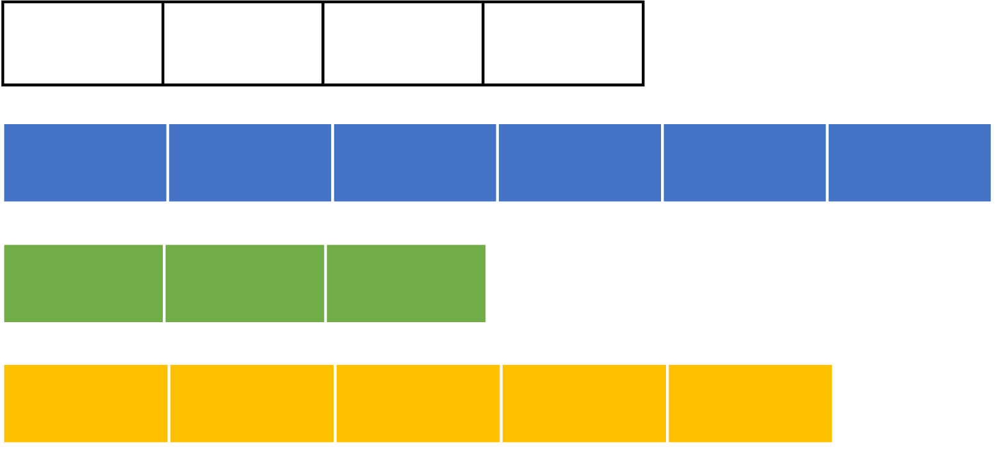
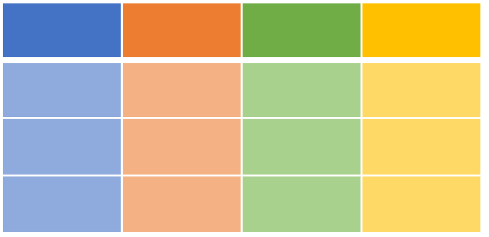

```{r setup, include=FALSE}
library(xaringanExtra)
library(RefManageR)
use_xaringan_extra(c("tile_view", "panelset", "share_again", "editable",
                     "clipboard", "progessbar"))
use_extra_styles(hover_code_line = TRUE, mute_unhighlighted_code = FALSE)

options(htmltools.dir.version = FALSE, knitr.table.format = "html", knitr.kable.NA = "")
knitr::opts_chunk$set(warning = FALSE, message = FALSE, fig.path = "figs/",
                      fig.width = 7.252, fig.height = 4, comment = "#>",
                      fig.retina = 3)
old <- ggplot2::theme_set(iheiddown::theme_iheid())
BibOptions(check.entries = FALSE,
           bib.style = "authoryear", # Bibliography style
           max.names = 3, # Max author names displayed in bibliography
           sorting = "nyt", #Name, year, title sorting
           cite.style = "authoryear", # citation style
           style = "markdown",
           hyperlink = FALSE,
           dashed = FALSE)
myBib <- ReadBib("assets/myBib.bib", check = FALSE)
```

class: split two

# What did we learn online?

--

.pull-left[

Conceptually:

- What is R?

- Why R?

- The R panes

- How to get help online

- *Clear conceptual thinking with data is important in R!*

]

--

.pull-right[

Practically:

```{r echo=TRUE, eval=FALSE}
setwd()
install.packages()
library()
read_csv()
View()
# +, -, *, / arithmetic operations.
# ? asking for help.
# <- the assign operator.
```

- *R messages, warnings, and error are informative, read them!*

]

---
class: split two

# Failure is another stepping stone to greatness, in R at least...

.pull-left[

- Questions about the online exercises or the videos?

]

.pull.right[


]

---
class: split two


.pull-left[
## Lecture:

  - R basics (objects and classes)
  - Data (from vector to data frames)
  - First wrangling steps (with base R)
]

.pull-right[
## Practical:

  - Download, load, and explore data
  - Grouping and subsetting data
  - Mind the gap with **GAPMINDER**
]

---
# R Basics

*"All I know is what I have words for” - Ludwig Wittgenstein*

--

## Objects

- What are objects in R?

--

Can be anything, as long as it is assigned...

```{r}
"Am I an object?"
object <- "Or I am an object?"
```

---
# The rules of the game (class 1/6)

*Object class is the grouping of objects that can be described in terms of the attributes its members have in common.*

Can anything be a class?

--

Yes, as long as the rules of the game are set as methods and are coherent!

--

But we are only talking about a few basic ones today...

---
# Character (class 2/6)

Just text...

```{r}
object1 <- "Or I am an object?"
class(object1)
# What can we do with character objects?
paste(object1, object1, sep = " - ")
```

---
# Numeric (class 3/6)

Some classes allow for arithmetic operations

```{r}
object2 <- 3
class(object2)
# Can we operate on numeric objects?
(object2*object2)/(object2+object2)
# Remember, parenthesis are important for the order of operations!
```

---
# Logical (class 4/6)

Either TRUE or FALSE

```{r}
true <- TRUE
class(true)
isTRUE(true) # Logical check
```

---
# Dates (class 5/6)

Dates in R can be annoying, specially if you are using base R...

```{r}
Sys.Date() # Get the current date
date <- Sys.Date()
class(date) # What can we do with data?
Sys.Date() - 1
```

Some R packages are excellent for this though [´{lubridate}´](https://www.jstatsoft.org/article/view/v040i03) and [´{messydates}´](https://globalgov.github.io/messydates/)

---
# Wait, what is that about "type"? (class 6/6)

Object class is often not the same as the object type...

Type refers to how the data is stored; the 5 basic types in R are double, integer, complex, logical, character

```{r}
class(1)
typeof(1)
```

**But if this is confusing to you, do not worry about it ...**

---
class: split two

# Fun(ish) break

.pull-left[

*Class matters?*

```{r}
as.numeric(as.Date("1970-01-01"))
```

- [pre-1900 dates in Excell](https://en.wikipedia.org/wiki/Year_1900_problem)

]

.pull-right[

]

---
class: split two

# Vectors (data structures 1/4)

*Vector*: one-dimensional with one type of data

.pull-left[

```{r}
lecturers <- c("Henrique", "Livio") # character
age <- c(81, 18) # numeric
speaks_portuguese <- c(TRUE, TRUE) # logical
```

]

.pull-right[


]

---
class: split two

# Matrixes (data structures 2/4)

*Matrix*: two dimensional objects with one class and a fixed number of rows/columns

.pull-left[

```{r}
matrix <- matrix(0, ncol = 2, nrow = 2)
matrix
dim(matrix) # get dimensions
# Names are vector attributes
# row.names(matrix) <- c("Henrique", "Livio") # set names
# dimnames(matrix) # get all names
```

There is also *arrays* but...

]

.pull-right[

]

---
class: split two

# Lists (data structures 3/4)

*Lists*: group together R objects of diverse classes or dimensions

.pull-left[
```{r}
list <- list(lecturers, age, speaks_portuguese)
list
```
]

.pull-right[

]

---
class: split two

# Data Frames (data structures 4/4)

As lists, *data frames* objects can have multiple possible classes but a fixed number of rows and columns

.pull-left[
```{r}
course <- data.frame(cbind(lecturers, age, speaks_portuguese))
course 
# cbind() binds columns, rbind() binds rows
```
]

.pull-right[

]

---
class: split two

#  Fun(ish) break ...

.pull-left[

[Are you paying attention to class right now?](https://connorrothschild.github.io/what-are-you-doing/)

]

.pull-right[


]


---
# You can navigate (through data) if you have $ (functions 1/6)

--

Is the "$" operator a function in R? (Hint: see ´?"$"´)

```{r}
# The $ operator can be used to extract part from an object:
course$lecturers
# Or replace parts of an object:
course$lecturers <- c("Sposito", "Silva-Muller")
```

**An operator in R is a function that can be written without parentheses...**

---
# If you do not have $, friends can help :[] (functions 2/6)

--

Brackets make some great friends (run ´?"["´ for help)

```{r}
course$lecturers[1] # first element in vector
course[1,0] # first row in all columns
course[0,1] # all rows in first column
course[1, 1] # first value in first column
```

---
# Factors (functions 3/6)

*Factor* in R refers to categories in variables

```{r}
course$lecturers <- factor(course$lecturers, levels = c("Silva-Muller", "Sposito"))
course$lecturers
```

---
# Logical operators (functions 4/6)

- "=="/"!=" are values equal/different?
- is bigger/bigger or equal ">"/">="  than?
- is smaller/smaller or equal "<"/"<=" than?

```{r}
course$lecturers[1] == course$lecturers[2]
course$age[2] < course$age[1]
```

--

**For multiple conditions, use "&"/"|" (and/or)**

```{r}
course$lecturers[1] != course$lecturers[2] & course$age[2] < course$age[1]
```

---
# If it is true, then yes! (functions 5/6)

We function ´ifelse()´ works with conditional element selection... (wait what?)

--

```{r, eval=FALSE}
ifelse(test, yes, no)
```

--

```{r}
course$old = ifelse(course$age > 30, "old", "young")
course
```

---
# GREP (Grammar of Regular Expressions) (functions 6/6)

Functions to find, match and replace strings!

```{r}
# Can we find if there is an "silva" in a variable?
grepl("silva", course$lecturers, ignore.case = TRUE)
# What if we want to replace it?
course$lecturers <- gsub("Silva", "Awesome", course$lecturers)
course
```

---
class: split two

# Fun break...

.pull-left[
```{r}
#install.packages("beepr")
library(beepr)
beep(8)
```

--

Gotcha you!

]

.pull-right[

]

---
class: split two

# Other useful functions we forgot?

--

.pull-left[
*Henrique*

```{r}
summary(course)
```
]

--

.pull-right[
*Livio*

```{r}
unique(c(1, 2, 2, 3, 3, 4, 5))
```
]

--

```{r}
mean(c(18, 81, 28))
median(c(18, 81, 28))
```

---
# Base R

- All operators we cover today are base R

- [Above all, teaching base R facilitates comprehension of how R, as a software and programming language, works for beginners](https://github.com/matloff/TidyverseSkeptic/)

---

class: center middle


---

# References

For more cool and informative slides about R stuff, see [favstats](https://favstats.github.io/ds3_r_intro/#1)

Douglas, A., Ross, D., Mancini, F., Couto, A. & Lusseau, D. (2022). An Introduction to R

Mesquita, E. B., & Fowler, A. (2021). Thinking clearly with data: A guide to quantitative reasoning and
analysis. Princeton University Press.

```{r refs, echo=FALSE, results="asis"}
RefManageR::PrintBibliography(myBib)
```
