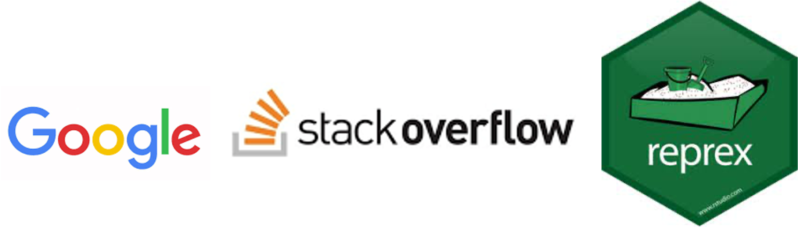
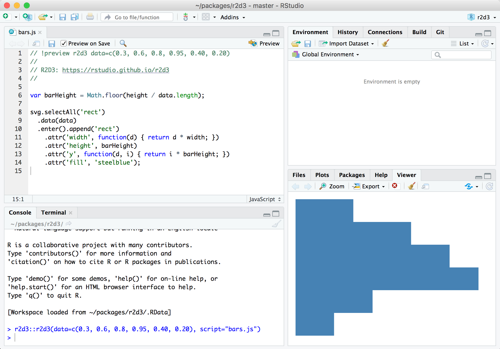

```{r setup, include=FALSE}
# don't mind this code chunk, it just sets up a few things for the rest
# it doesn't appear, because the include argument above is FALSE...
options(htmltools.dir.version = FALSE, servr.daemon = TRUE)
knitr::opts_chunk$set(cache=TRUE, autodep = TRUE, fig.retina = 3, message = FALSE, warning = FALSE)
old <- ggplot2::theme_set(iheiddown::theme_iheid())
```

```{r, load_refs, include=FALSE, cache=FALSE}
# Initializes the bibliography
library(RefManageR)
BibOptions(check.entries = FALSE,
           bib.style = "authoryear", # Bibliography style
           max.names = 3, # Max author names displayed in bibliography
           sorting = "nyt", #Name, year, title sorting
           cite.style = "authoryear", # citation style
           style = "markdown",
           hyperlink = FALSE,
           dashed = FALSE)
myBib <- ReadBib("assets/myBib.bib", check = FALSE)
# Note: don't forget to clear the knitr cache to account for changes in the
# bibliography.
```

class: center

# The world back then... (and now)

<iframe width="800" height="450" src="https://www.youtube.com/embed/kOO31qFmi9A" title="YouTube video player" frameborder="0" allow="accelerometer; autoplay; clipboard-write; encrypted-media; gyroscope; picture-in-picture" allowfullscreen></iframe>1

---
class: split two center

# Who are we?

--

.pull-left[


[***Henrique***](https://github.com/henriquesposito)

]
--
.pull-right[


***Livio***

]

---


- What is R?

- Course outline

- Installation and first (R)steps

- Case study

---

# What is R?

- Programming language and software develop in 1990s by Ihaka and Gentleman [(see Ihaka and Gentleman 1996)](https://www.jstor.org/stable/1390807#metadata_info_tab_contents), but really only released in 2000...

- Open source with extensive and coherent set of tools for statistical analysis and programming

- More than a statistics software:
  - text analysis
  - scraping
  - websites
  - interactive applications
  - presentations (like this one)
  - and much more!

**Thank you RStudio (and [Hadley](https://hadley.nz/))!**
.pull-right[

]

---

class: split two

# Why R?

--
.pull-left[

- [R growth has been impressive, specially within academia and governments](https://stackoverflow.blog/2017/10/10/impressive-growth-r/)


- Fast(ish), Flexible, and Free

- Visualize, Communicate, Share, and Reproduce

- Thousands of packages

- Other programming languages can be integrated (as Phyton and C)
]

--
.pull-right[
[But the learning curve can be steep...](https://www.r-bloggers.com/2020/12/6-reasons-to-learn-r-for-business-2021/)


]

---
class: split two

# Is this course for you?

.pull-left[
## This course is not...

- a statistics course, but...

- a programming course, but...
]

.pull-right[
## This course is...

- for beginners...

- for social science research ...
]

**No statistical software is a substitute for clear conceptual thinking, they are just tools (specially R). Thinking and data are compliments, not substitutes (Mesquita and Fowler 2021).**

---
# Course objectives

By the end of this course you should be able to:

- import data

- clean and wrangle data

- visualize variation

- produce reproducible reports

***Above all:***

- *continue to learn R on your own*

- *ask/find help online*

---
# Course polices and assignments

- Attendance (20%)

  - Come to class and be respectful

- Weekly assignments (30%)

  - Try your best and remember to ask for help, if needed
  - 3 assignments released after lecture and due by midnight on the day before the following lecture

- Final assignment (50%)

  - Available on the October 21st and due on November 6th at 23:59

**Office Hours: Wednesdays 15:00 to 17:00 P1-547**

---
# How to... google

- R is collaborative

- Google, google, google (and stack overflow) until you make it!

- "How to (...) in R?"

- But if none of that works, ask in the Moodle and we will help

.pull-right[

]

---
class: split two

# The R(Studio) panes

.pull-left[
- Console

- Source Editor

- Environment

- Plots (and files)
]

.pull-right[

]

---
# Questions?

**Rstallation**

- If you do not have R installed, stay and we will try together...

- If yes, you have a 5 minutes brake...

---
class: center with-logo

# References

Made with `{iheiddown}`, the R-package for IHEID publications
`r Cite(myBib, "iheiddown")`.

```{r refs, echo=FALSE, results="asis"}
RefManageR::PrintBibliography(myBib)
```
