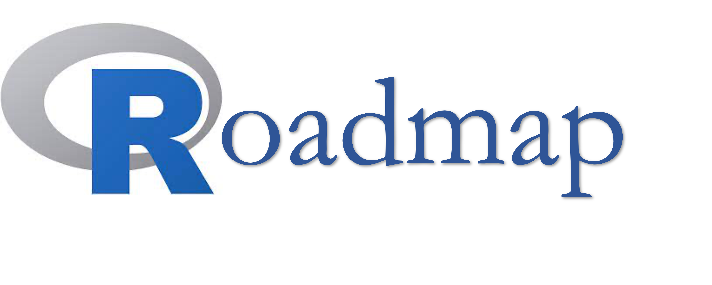
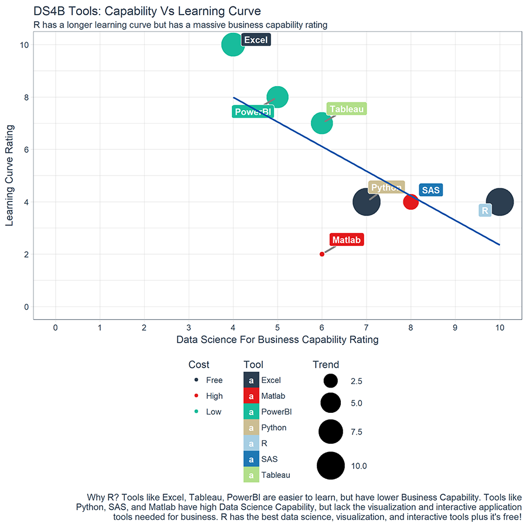

```{r setup, include=FALSE}
# don't mind this code chunk, it just sets up a few things for the rest
# it doesn't appear, because the include argument above is FALSE...
options(htmltools.dir.version = FALSE, servr.daemon = TRUE)
knitr::opts_chunk$set(cache=TRUE, autodep = TRUE, fig.retina = 3, message = FALSE, warning = FALSE)
old <- ggplot2::theme_set(iheiddown::theme_iheid())
```

```{r, load_refs, include=FALSE, cache=FALSE}
# Initializes the bibliography
library(RefManageR)
BibOptions(check.entries = FALSE,
           bib.style = "authoryear", # Bibliography style
           max.names = 3, # Max author names displayed in bibliography
           sorting = "nyt", #Name, year, title sorting
           cite.style = "authoryear", # citation style
           style = "markdown",
           hyperlink = FALSE,
           dashed = FALSE)
myBib <- ReadBib("assets/myBib.bib", check = FALSE)
# Note: don't forget to clear the knitr cache to account for changes in the
# bibliography.
```



- What is R?

- Course outline

- Instillation and first Rsteps

- Case study

---
class: split two center

# Who are we?

--

.pull-left[


***Henrique***

]
--
.pull-right[


***Livio***

]

---
class: center

# What skills do you need for your job market nowadays?

<iframe width="800" height="450" src="https://www.youtube.com/embed/kOO31qFmi9A" title="YouTube video player" frameborder="0" allow="accelerometer; autoplay; clipboard-write; encrypted-media; gyroscope; picture-in-picture" allowfullscreen></iframe>1

---
# What is R?

- Programming language and software develop in 1990s by Ihaka and Gentleman [(see Ihaka and Gentleman 1996)](https://www.jstor.org/stable/1390807#metadata_info_tab_contents), but really only released in 2000...

- Open source with extensive and coherent set of tools for statistical analysis

- But much more than an statistics software, from text analysis to presentations (like this one), interactive Shinny applications, and much more!

**Thank you RStudio (and Hadley)!**
.pull-right[

]

---

class: split two

# Why R?

--
.pull-left[

- Fast(ish), Flexible, and Free

- Visualize, Communicate, and Share

- Thousands of packages and collaborative community

- Reproducible

- Easily integrated with other programming languages (as Phyton and C)

- [R growth has been impressive, specially within academia and governments](https://stackoverflow.blog/2017/10/10/impressive-growth-r/)
]

--
.pull-right[
[But the learning curve can be steep...](https://www.r-bloggers.com/2020/12/6-reasons-to-learn-r-for-business-2021/)


]

---
class: center with-logo

# References

Made with `{iheiddown}`, the R-package for IHEID publications
`r Cite(myBib, "iheiddown")`.

```{r refs, echo=FALSE, results="asis"}
RefManageR::PrintBibliography(myBib)
```
