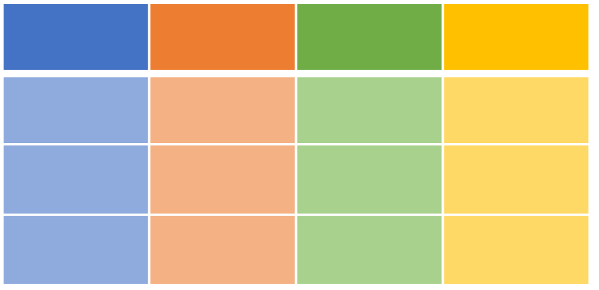

```{r setup, include=FALSE}
# don't mind this code chunk, it just sets up a few things for the rest
# it doesn't appear, because the include argument above is FALSE...
options(htmltools.dir.version = FALSE, servr.daemon = TRUE)
knitr::opts_chunk$set(cache=TRUE, autodep = TRUE, fig.retina = 3, message = FALSE, warning = FALSE)
old <- ggplot2::theme_set(iheiddown::theme_iheid())
```

```{r, load_refs, include=FALSE, cache=FALSE}
# Initializes the bibliography
library(RefManageR)
BibOptions(check.entries = FALSE,
           bib.style = "authoryear", # Bibliography style
           max.names = 3, # Max author names displayed in bibliography
           sorting = "nyt", #Name, year, title sorting
           cite.style = "authoryear", # citation style
           style = "markdown",
           hyperlink = FALSE,
           dashed = FALSE)
myBib <- ReadBib("assets/myBib.bib", check = FALSE)
# Note: don't forget to clear the knitr cache to account for changes in the
# bibliography.
```

class: split two

# What did we learn last week?

--

.pull-left[

Conceptually:

- What is R?

- Why R?

- The R panes

- How to get help online

- Remember: Clear conceptual thinking with data is important in R!

]

--

.pull-right[

Practically:

- How to set the working directory

- How to download and load r packages

- How to save objects in the environment

- How to find help within R

- Remember: R messages, warnings, and error are informative, read them!

]

---

class: split two

# Failure is another stepping stone to greatness, in R at least...

.pull-left[

*Let's quickly review some of the package related, and other coding errors we saw in R from last class!*

- Any other general questions?

]

.pull.right[


]

---

class: split two


.pull-left[
## Lecture:

  - R basics (objects, classes, and functions)
  - Data (from vector to data frames)
  - First wrangling steps (with base R)
]

.pull-right[
## Practical:

  - Download and load data
  - Exploring data
  - Arithmetic and logical operations
]

- Case study: **Mind the Gap with GAPMINDER**

---

# R Basics

*"All I know is what I have words for” - Ludwig Wittgenstein*

--

## Objects

- What are objects in R?

--

*Can be anything, as long as it is assigned...*

```{r}
"Am I an object?"
object <- "Or I am an object?"
```

---

# The Rules of the Game (class 1/6)

*Object class is the grouping of objects that can be described in terms of the attributes its members have in common.*

## Can anything be a class?

--

*Yes (as long as the rules of the game are set as methods and are coherent)!*

But we are only talking about a few basic ones today...

---

# Character (class 2/6)

Just text

```{r}
object1 <- "Or I am an object?"
class(object1)
# What can we do with character objects?
paste(object1, object1, sep = " - ")
```

---

# Numeric (class 3/6)

Some classes allow for arithmetic operations

```{r}
object2 <- 3
class(object2)
# Can we operate on numeric objects?
(object2*object2)/(object2+object2)
# Remember, brackets are important for order of operations!
```

---

# Logical (class 4/6)

Either TRUE or FALSE

```{r}
object3 <- c(TRUE, FALSE)
class(object3)
isTRUE(object3[2]) # Logical check
```

---

# Dates (class 5/6)

Dates in R can be annoying, specially if you are using base R...

```{r}
Sys.Date() # get the current date
object4 <- as.Date(c("2022-09-23", "2022-09-30"))
class(object4) # What can we do with data?
object4[2] - object4[1]
```

Some R packages are excellent for this though [´{lubridate}´](https://www.jstatsoft.org/article/view/v040i03) and [´{messydates}´](https://globalgov.github.io/messydates/)

---
class: split two

# Class matters... (class 6/6)

.pull-left[

]

.pull-right[
```{r}
as.numeric(as.Date("1970-01-01"))
```
]

---

class: split two 

# Vectors (data structures 1/4)

*Vector*: one-dimensional with one type of data

.pull-left[

```{r}
lecturers <- c("Henrique", "Livio") # character
age <- c(81, 18) # numeric
speaks_portuguese <- c(TRUE, TRUE) # logical
```

]

.pull-right[

]

---
class: split two

# Matrixes (data structures 2/4)

*Matrix*: two dimensional objects with one class and a fixed number of rows/columns

.pull-left[

```{r}
matrix <- matrix(0, ncol = 2, nrow = 2)
matrix
dim(matrix) # get dimensions
# Names are vector attributes
# row.names(matrix) <- c("Henrique", "Livio")
# dimnames(matrix) # get dimension names
```

There is also *Arrays* but...

]

.pull-right[

]

---
class: split two

# Lists (data structures 3/4)

*lists*: group together R objects of diverse classes or dimensions

.pull-left[
```{r}
list <- list(lecturers, age, speaks_portuguese)
list
```
]

.pull-right[

]

---
class: split two

# Data Frames (data structures 4/4)

As lists, *data frames* objects can have multiple possible classes but a fixed number of rows and columns

.pull-left[
```{r}
course <- data.frame(cbind(lecturers, age, speaks_portuguese))
course # cbind() binds columns, rbind() binds rows
```
]

.pull-right[

]

---
class: center middle

<blockquote class="twitter-tweet"><p lang="en" dir="ltr">How to add many data frame columns efficiently in R <a href="https://t.co/ONnvhAewk3">https://t.co/ONnvhAewk3</a> <a href="https://twitter.com/hashtag/parallelprocessing?src=hash&amp;ref_src=twsrc%5Etfw">#parallelprocessing</a> <a href="https://twitter.com/hashtag/r?src=hash&amp;ref_src=twsrc%5Etfw">#r</a> <a href="https://twitter.com/hashtag/mutate?src=hash&amp;ref_src=twsrc%5Etfw">#mutate</a> <a href="https://twitter.com/hashtag/forloop?src=hash&amp;ref_src=twsrc%5Etfw">#forloop</a> <a href="https://t.co/r7tiAdSNMv">pic.twitter.com/r7tiAdSNMv</a></p>&mdash; Meme Overflow (@overflow_meme) <a href="https://twitter.com/overflow_meme/status/1370272994791206913?ref_src=twsrc%5Etfw">March 12, 2021</a></blockquote> <script async src="https://platform.twitter.com/widgets.js" charset="utf-8"></script>

---

# You can navigate (through data) if you have $

--

Is the "$" operator a function in R (see ´?"$"´)?

```{r}
# The $ operators can be used to extract part from an object:
course$lecturers
# Or replace parts of an object:
course$lecturers <- c("Sposito", "Silva-Muller")
```

---

# If you do not have $, friends can help!

--

Indeed brackets :[] make some great friends

```{r}
course[1] # first column
course[1, ] # first row in all columns
course[1,1] # value in first row of the first column
course[1:2, 2] # the two first values in column 2
```

---

# Factors

*Factor* in R refers to categories in variables

```{r}
course$lecturers <- factor(course$lecturers, levels = c("Silva-Muller", "Sposito"))
course$lecturers
```

---

# Logical operators

- "=="/"!=" are values equal/different?
- is bigger/bigger or equal ">"/">="  than?
- is smaller/smaller or equal "<"/"<=" than?

```{r}
course$lecturers[1] == course$lecturers[2]
course$age[2] < course$age[1]
```

**For multiple conditions, use "&"/"|" (and/or)**

```{r}
course$lecturers[1] != course$lecturers[2] & course$age[2] < course$age[1]
```

---
# If it is true, then yes!

We function ´ifelse()´ works with coditional element selection... (wait what?)

--

```{r, eval=FALSE}
ifelse(test, yes, no)
```

--

```{r}
course$old = ifelse(course$age > 30, "old", "young")
course
```

---

# GREP (Grammar of Regular Expressions)

Functions to find, match and replace strings!

```{r}
# Can we find if there is an "silva" in a variable?
grepl("silva", course$lecturers, ignore.case = TRUE)
# What if we want to replace it?
course$lecturers <- gsub("Silva", "Awesome", course$lecturers)
course
```

---

class: split two

# Other useful base R functions we forgot?

--

.pull-left[

*Henrique*

```{r}
summary(course)
```

]

.pull-right[

*Livio*

```{r}
course$nationality <- c("BR", "BR")
unique(course$nationality)
```

]

--

```{r}
mean(c(18, 81, 28))
median(c(18, 81, 28))
```

---

# Base vs. Tidy (again)

- All operators we cover today here and in the practice exercises are base R.

- In reality, most users should use both, whatever is easier and more intuitive to you!

- [Above all, teaching base R facilitates comprehension of how R, as a software and programming language, works for beginners](https://github.com/matloff/TidyverseSkeptic/)

---

class: center middle


---

# References

For more cool and informative slides about R stuff, see [favstats](https://favstats.github.io/ds3_r_intro/#1)

Douglas, A., Ross, D., Mancini, F., Couto, A. & Lusseau, D. (2022). An Introduction to R

Mesquita, E. B., & Fowler, A. (2021). Thinking clearly with data: A guide to quantitative reasoning and
analysis. Princeton University Press.

```{r refs, echo=FALSE, results="asis"}
RefManageR::PrintBibliography(myBib)
```
