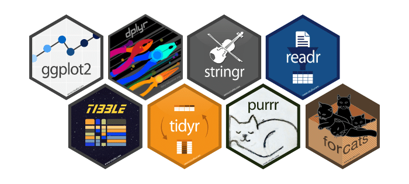

```{r setup, include=FALSE}
# don't mind this code chunk, it just sets up a few things for the rest
# it doesn't appear, because the include argument above is FALSE...
options(htmltools.dir.version = FALSE, servr.daemon = TRUE)
knitr::opts_chunk$set(cache=TRUE, autodep = TRUE, fig.retina = 3, message = FALSE, warning = FALSE)
old <- ggplot2::theme_set(iheiddown::theme_iheid())
```

```{r, load_refs, include=FALSE, cache=FALSE}
# Initializes the bibliography
library(RefManageR)
BibOptions(check.entries = FALSE,
           bib.style = "authoryear", # Bibliography style
           max.names = 3, # Max author names displayed in bibliography
           sorting = "nyt", #Name, year, title sorting
           cite.style = "authoryear", # citation style
           style = "markdown",
           hyperlink = FALSE,
           dashed = FALSE)
myBib <- ReadBib("assets/myBib.bib", check = FALSE)
# Note: don't forget to clear the knitr cache to account for changes in the
# bibliography.
```

class: split two

# What did we learn last week?

--

.pull-left[

Conceptually:

- What are objects?

- What are classes?

- What are data structures?


]

--

.pull-right[

Practically:

```{r echo=TRUE, eval=FALSE}
# <- the assign operator
# $  the extract operator
# == , !=, =<, >=  logical operators
# &, /, | conditions
# [1,3] #brackets  
class()
dim() 
length() 
summary()
data.frame()
median()
mean()
subset()
ifelse()
grepl()
```


]

---

class: split two

# Homework for today

.pull-left[

*Let's start by going through the homework together!*

- Common issues


- Any other general questions?

]

.pull.right[


]

---

class: split two


.pull-left[
## Lecture:

  - Tidyverse, tidy-thinking, tidy-data
  - From untidy to tidy
  - From tidy to findings
]

.pull-right[
## Practical:

  - tidyr: cleaning
  - dplyr: wrangling
]


- Case study: **How has the Brazilian Amazon been constructed as a problem?**

---

# What is the tidyverse? (1/2)


Universe of tidiness? From the [´{tidyverse}´](https://www.tidyverse.org/) website:


> The tidyverse is an opinionated **collection of R packages** designed for data science. All packages share an underlying design philosophy, grammar, and data structures.


---

# What is the tidyverse? (2/2)

## Installing and loading the tidyverse:

```{r, eval = F}
install.packages("tidyverse")
```

```{r}
library(tidyverse)
```

## What is in the tidyverse?



---

# Tidy data (1/4)

  - What is tidy data?
    - Each column is one variable.
    - Each row is one case/observation.
    - Each cell stores one value.
 

.fifty[Check: [Garrett Grolemund's post for a great explanation of tidy data](https://garrettgman.github.io/tidying/)]

---

# Tidy data (2/4)


##Is this tidy?

| Animal | Conversion  |
| --- | --- | 
| Domestic dog | 24.0 / 5.10 |
| Domestic cat | 30.0 / 4.08 |
| American alligator | 77.0 / 1.59 | 
| Golden hamster | 3.9 / 31.41 |
| King penguin | 26.0 /  4.71 |

--

No! Cells in the second column contain two values.

.fifty[Author: [Fabio Votta](https://github.com/favstats)]

---

# Tidy data (3/4)


##Is this tidy?

| Animal | Type | Value  |
| --- | --- | --- | 
| Domestic dog | lifespan | 24.0 |
| Domestic dog | ratio | 5.10 |
| Domestic cat | lifespan | 30.0 |
| Domestic cat | ratio | 4.08 |
| American alligator | lifespan | 77.0 | 
| American alligator | ratio | 1.59 |

--

No! The second column contains two variables.

.fifty[Author: [Fabio Votta](https://github.com/favstats)]

---

# Tidy data:one last example (4/4)


## from untidy...


| country | 1999 | 2000  |
| --- | --- | --- | 
| Afghanistan | 19987071 | 20595360 |
| Brazil | 172006362 | 174504898 |

--

##...to tidy!

| country | year | population  |
| --- | --- | --- | 
| Afghanistan | 1999 | 19987071 |
| Afghanistan | 2000 | 20595360 |
| Brazil | 1999 | 172006362 |
| Brazil | 2000 | 174504898 |
---

# So, how we get to tidy data?

## We use [´{tidyr}´](https://github.com/rstudio/cheatsheets/blob/main/tidyr.pdf)

- `pivot_wider()` extends data by tidying columns with more than one variable.
- `pivot_longer()` extends data by tidying rows that contain variables.
  
  
- `separate()` separates data by tidying columns with two variables or values.
  - `unite()` does the opposite
  
## Let's test this in the following slides.
---

# Here is some untidy data from earlier


```{r include=FALSE}

library(readxl)
untidy_population_dat <- read_excel("~/Documents/GitHub/Fundamentals_of_R_IHEID2022/Lecture 3/Lecture_3_Presentation/assets/data/untidy_dat.xlsx")
untidy_food <- read_excel("~/Documents/GitHub/Fundamentals_of_R_IHEID2022/Lecture 3/Lecture_3_Presentation/assets/data/untidy_dat2.xlsx")

```

```{r}

untidy_population_dat

```

---

# `separate()` and `unite()`

```{r echo=FALSE}

untidy_population_dat

```

```{r}

tidy_population <- separate (untidy_population_dat, country, sep="-", into=c("country", "region"))

```

--

```{r echo=FALSE}

tidy_population

```
---

# `pivot_longer()`

- `pivot_longer()` extends  data by tidying rows that contain variables.
 - this means more observations, i.e. *longer* dataset.

```{r}

tidy_population <- pivot_longer(tidy_population,cols=c("1999","2000"), names_to="year", values_to = "population")

```
--
```{r echo=FALSE}

tidy_population

```
---

# `pivot_wider()`

- `pivot_wider()` extends data by tidying columns with more than one variable.
 - this means more variables, i.e. *wider*.

.pull-left[
```{r}

untidy_food

```
]

--

.pull-right[
```{r}

tidy_food <- pivot_wider(untidy_food,names_from=food, values_from=grade)

```

--

```{r echo=FALSE}

tidy_food

```

]

---
# Tidy, tidy, tidy...


.fifty[Artist: [Allison Horst](https://github.com/allisonhorst)].

---
class: split two

# ...but, a note of caution:

.pull-left[

]

.pull-right[

-Tidy data is great for working with tidy packages.

-Nevertheless, tidying data might take sometime.

-Do you really need to separate first and last name in two columns?

]
--

##Think about it conceptually before tidying everything!

---

# Now that things are tidy (or tidier), it's time to wrangle

--

By wrangling, we mean manipulating, and for this we use [´{dplyr}´](https://github.com/rstudio/cheatsheets/blob/main/data-transformation.pdf)
--

> The dplyr package is a **grammar of data manipulation**, providing a consistent set of verbs that help you solve the most common data manipulation challenges: creating,adding, picking, reducing, and changing variables.


```{r include=FALSE}

library(readr)

io_income <- read_csv("~/Documents/GitHub/Fundamentals_of_R_IHEID2022/Lecture 3/Lecture_3_Presentation/assets/data/io_income_rs.csv")


library(tidyverse)
```

---
##Let's work with dataset on the income of international organizations!

```{r}
head(io_income)
```

---
# Select (dplyr verbs 1/7)

`select ()` selects variables in the dataframe.


```{r}

io_income_select <- select(io_income, donor, type_donor)

```
--
```{r}

head (io_income_select)

```
---
##...glimpse the dataset

```{r echo=FALSE}
head(io_income)
```
---
# Filter (dplyr verbs 2/7)

`filter ()` subsets data frame by a condition in the observations.

```{r}
io_income_filter <- filter(io_income, donor=="Switzerland")
```
--
```{r echo=FALSE}
io_income_filter
```

---
##...glimpse the dataset

```{r echo=FALSE}
head(io_income)
```
---
# Mutate (dplyr verbs 3/7)

`mutate ()` creates new variables.


```{r}
io_income_mutate <- mutate(io_income,thousands_USD=amount_nominal/1000)
```
-- 
```{r echo=FALSE}
io_income_mutate
```

---
##...glimpse the dataset

```{r}
head(io_income)
```
---
# Group_by and Summarise (dplyr verbs 4/7)

`group_by()` groups data based on a characteristic to subsequently perform certain operations.
`summarise()` creates a new dataframe by combining grouped variables.


```{r}

io_income_grouped<- group_by(io_income, issue_area)
io_income_summarised <- summarise(io_income_grouped, amount_nominal = sum(amount_nominal, na.rm = TRUE))
```
--
```{r echo=FALSE}

io_income_summarised
```
---
# The Pipe Operator `%>%` (6/7)

---
# Joining things (dplyr verbs 7/7)

---
# and many others that we cannot cover here....


---

# Base vs. Tidy (re-visited)

- All operators we cover today here and in the practice exercises are base R.

- In reality, most users should use both, whatever is easier and more intuitive to you!

- [Above all, teaching base R facilitates comprehension of how R, as a software and programming language, works for beginners](https://github.com/matloff/TidyverseSkeptic/)

---

class: center middle


---

# References

For more cool and informative slides about R stuff, see [favstats](https://favstats.github.io/ds3_r_intro/#1)

Douglas, A., Ross, D., Mancini, F., Couto, A. & Lusseau, D. (2022). An Introduction to R

Mesquita, E. B., & Fowler, A. (2021). Thinking clearly with data: A guide to quantitative reasoning and
analysis. Princeton University Press.

```{r refs, echo=FALSE, results="asis"}
RefManageR::PrintBibliography(myBib)
```
