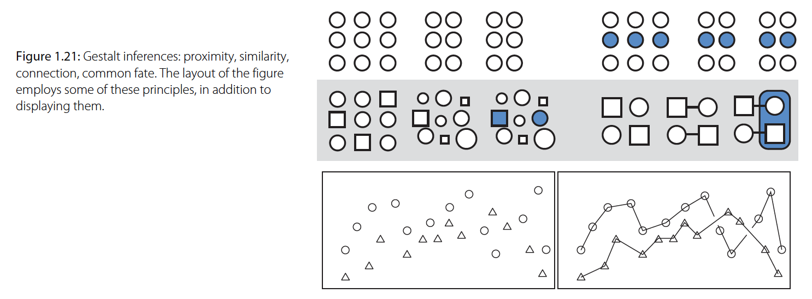
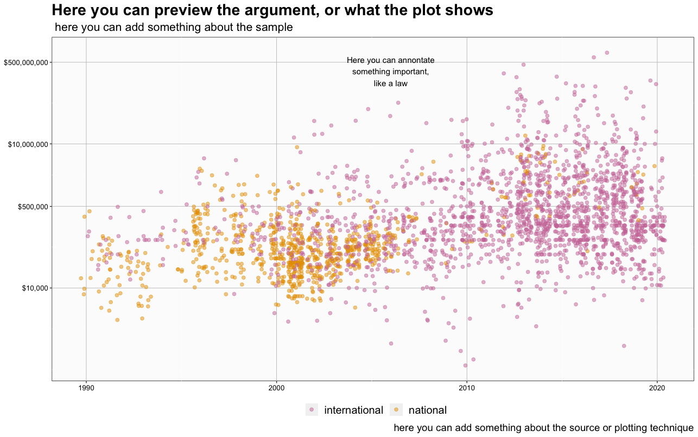
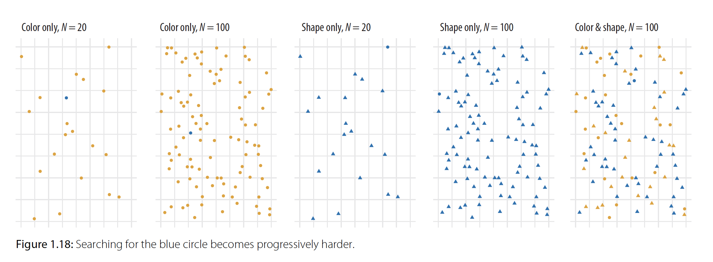
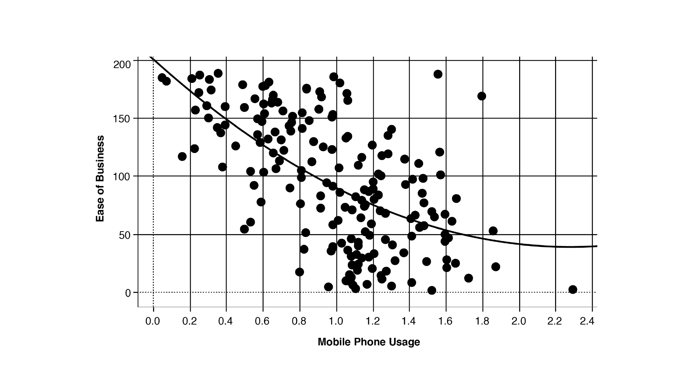
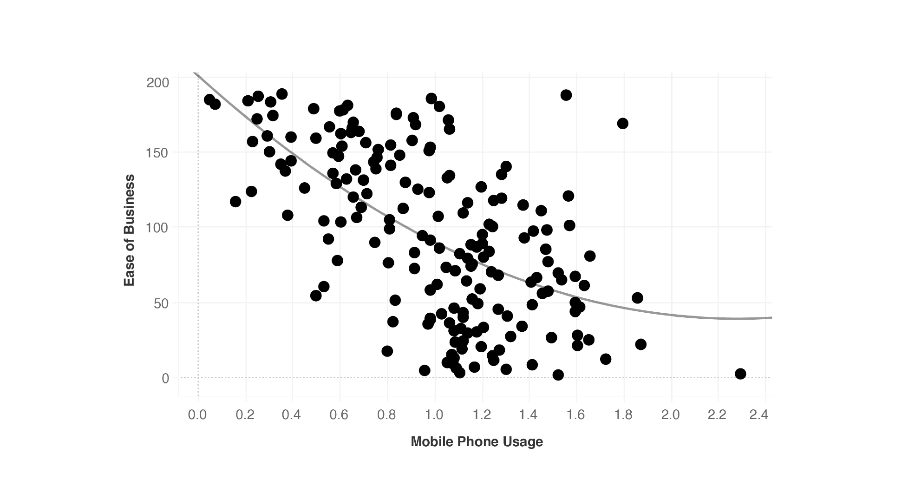
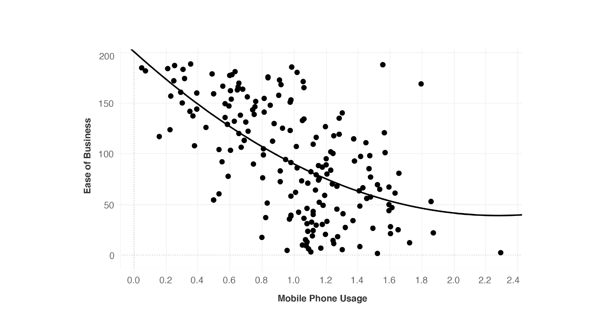
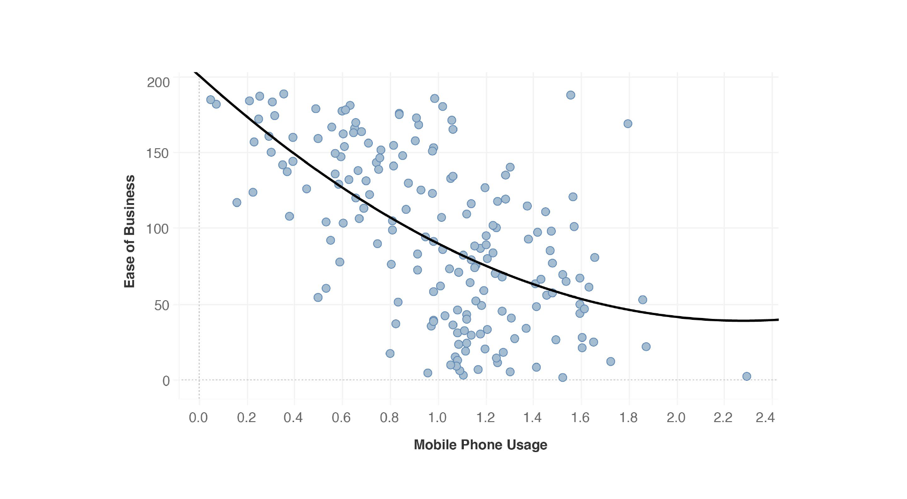
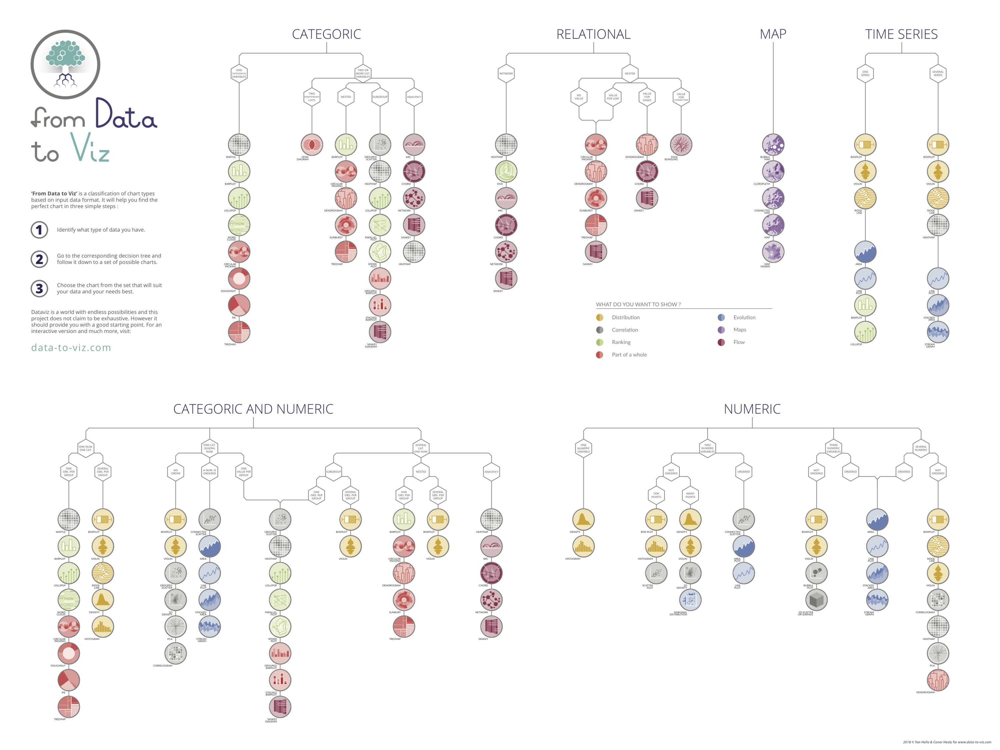

```{r setup, include=FALSE}
# don't mind this code chunk, it just sets up a few things for the rest
# it doesn't appear, because the include argument above is FALSE...
options(htmltools.dir.version = FALSE, servr.daemon = TRUE)
knitr::opts_chunk$set(cache=TRUE, autodep = TRUE, fig.retina = 3, message = FALSE, warning = FALSE)
old <- ggplot2::theme_set(iheiddown::theme_iheid())
```

```{r, load_refs, include=FALSE, cache=FALSE}
# Initializes the bibliography
library(RefManageR)
BibOptions(check.entries = FALSE,
           bib.style = "authoryear", # Bibliography style
           max.names = 3, # Max author names displayed in bibliography
           sorting = "nyt", #Name, year, title sorting
           cite.style = "authoryear", # citation style
           style = "markdown",
           hyperlink = FALSE,
           dashed = FALSE)
myBib <- ReadBib("assets/myBib.bib", check = FALSE)
# Note: don't forget to clear the knitr cache to account for changes in the
# bibliography.
```

---
class: split two

# What did we learn last week?

--

.pull-left[

Conceptually:

- Tidy datasets

- Wrangling data

- Functional Programming


]

--

.pull-right[

Practically:

```{r echo=TRUE, eval=FALSE}
# %>% the pipe operator
separate()
unite()
pivot_long()
pivot_wide()
select()
filter()
mutate()
group_by()
summarize()
count()
left_join() #family of functions to join datasets

```

]


---
class: split two

# Homework for today

.pull-left[

*Let's start by going through the homework together!*

- Common issues


- Any other general questions?

]

.pull.right[


]

---

class: split two


.pull-left[
## Lecture:

  - Principles of good visualization.
  - Grammar of Graphs (ggplot2).
  - Basic plots.
 
]

.pull-right[
## Practical:

  - Bar plots, line (and smoothed) plots, scatter (and jittered) plots, and box plots.
  - How to size, color, shape and label things.
  - How to facet plots.

]


---
#What makes good visualization?

--

- *Gestalt Principles*: sizes, colors, and shapes can structure a plot.

--

- *Tufte's Principle*: too much visual information makes comprehension more difficult.

--

##In other words:

- Leverage size, color, and shapes to...

- ...decrease unnecessary information while highlighting necessary information,

- **So one plot, tells one story clearly**.

---
## Gestalt principles (1/5)



- We look for structure... and we infer relationships from structure!

--

  - **Proximity**: things that are spatially near to one another seem related.
  
--

  - **Similarity**: things that look alike seem to be related.
  
--

  - **Connections**: things that are connected seem to be related.

--

.fifty[Image from and text adapted from: [Healy, 2018](https://socviz.co/)]
---
class: center middle

##  Gestalt principles: sizing things (2/5)


---
##  Gestalt principles: sizing things (3/5)

- Size, more than order, will define what is noticed first.
- Size things around and in your plot by their hierarchy of importance.

--



---
##  Gestalt principles: shapping and colouring things (4/5)




.fifty[Image from: [Kieran Healy](https://kieranhealy.org/blog/)]

---
##  Gestalt principles: shapping and colouring things (5/5)

.pull-left[

- Shape or color are good when you want to show contrast.

- Both together are often too much.
  - If you have color, shape, and two axis you are plotting 4 variables!

- Choose colors based on
  - the relationship: continuous or discrete?
  - intution: red for high temperatures, blue for low.

- *Remember: colorblindness is more frequent than you think!*

]

--

.pull-right[

```{r}
library(RColorBrewer)
display.brewer.all(colorblindFriendly = TRUE)
```


]

---
#Tufte's Law: Reduce data-to-ink ratio



---
#Tufte's Law: Reduce data-to-ink ratio


---
#Tufte's Law: Reduce data-to-ink ratio


---
#Tufte's Law: Reduce data-to-ink ratio


---
#One plot, one clear story!

.pull-left[


]

--

.pull-right[


]

---
## Okay, but how do I know which plot is the best plot?




.fifty[From: [Data-to-Viz](https://www.data-to-viz.com/#explore)]

---
# How do I plot?

--
We will use a package called the [´{ggplot2}´](https://ggplot2.tidyverse.org/)


> ggplot2 is a system for declaratively creating graphics, based on **The Grammar of Graphics**. You provide the data, tell ggplot2 how to map variables to aesthetics, what graphical primitives to use, and it takes care of the details.

--

- Map variables to aesthetics: linking data do things you see.
- Graphical primitives: type of graph you want ( line, box, scatter...)

.fifty[All slides below are highly inspired from [Healy, 2018](https://socviz.co/) check out his blog and book!]
---
#ggplot2: a general workflow (1/5)

- Tell ggplot2 **what we want to see**: the data and the variables.
  - What are our axis?
  - Do we want colors?
  - Do we want sizes?
  
--
  
- Tell ggplot2 **how you want to see it**: the types of graphs (points, lines, boxes)
  - What type of graph we want?
  - Do we want more graphs on it?
  - Do we want to add some summary statistics?
  
--

- Tell ggplot2 **how to improve what is there**: scales, labels, titles, marks and so forth.
  - Do we want titles, sub-titles, captions?
  - Are the scales meaningful?
  - Are legends and marks explanatory?
  
---
##the data for the next few slides

```{r}

library(gapminder) #downloading the package with the data
library(dplyr) # loading dplyr
data("gapminder") # loading the data from the package
sample_n(gapminder,15) #showing a random sample

```

---
#ggplot2: what we want to see (2/5)

.pull-left[

First, let's tell ggplot what data we have, and how to map variables to aesthetics.
  - Our data is gapminder.
  - Our x will be GDP per capita, our y life expectancy.
 
```{r}

library(ggplot2)
p<- ggplot(data=gapminder, mapping=aes(x=gdpPercap, y=lifeExp))

```

]

--

.pull-right[

```{r echo=FALSE}
p
```
]


---
#ggplot2: how we want to see (3/5)

.pull-left[

Second, let's tell ggplot2 how we want to see the relationships.
- `geom_point()` inherits the x and y as we specified inside the `ggplot()`, and draws points for observations.
- We can just **add** the geom to the object p we created.
- In ggplot2 we add things, because we are **layering** rather than piping.
 
```{r}
p <- p+ geom_point()
```

]

--

.pull-right[

```{r echo=FALSE}

p

```
]
---
#ggplot2: how we want to see (4/5)

.pull-left[

- `geom_()` is a family of functions that built various types of graphs (bar, lines, boxes)

- There are multiple kinds of geoms, you can check them in the cheat sheet for [´{ggplot2}´](https://github.com/rstudio/cheatsheets/blob/main/data-visualization-2.1.pdf)

- Following the logic of layering, you can just add a new geom to the object we have.

- In this case, we are adding `geom_smooth()`.
```{r}

p<- p+ geom_smooth() #smooth plots a trend line.

```

]

--

.pull-right[

```{r echo=FALSE}
p
```
]

---
#ggplot2: how to improve what we see (5/5)

- Third (and finally), we improve what we see.
  - We can scale x in log because the range of gdpPercap is too big: `scale_x_log10()`.
  - Inside the `scale_()` is also a familiy of various functions doing different things.
  - Inside `scale_x_log10()`, we can specify the unit of measurement as dollars.
  

.pull-left[

```{r}

p<- p+
  scale_x_log10(labels=scales::dollar) 
# scale_x_log10() rescales our x to improve visualization
```

]

--

.pull-right[

```{r echo=FALSE, out.width="75%"}
p
```

]

---
##We can add titles, subtitles, axis-titles and caption with `labs()`.

.pull-left[

```{r}

p<- p+
    labs( y="Life Expectancy", x=" GDP per Capita",
        title= "Life expectancy and GDP per capita",
        subtitle=" Dataset composed of 142 countries from 1952 to 2007",
        caption= "Source: Gapminder Dataset")
# labs add axis titles, titles, subtitles, and captions.
```

]

--

.pull-right[

```{r echo=FALSE, out.width="75%"}
p
```

]

---
## We can change sizes, font, and face with `theme()`.

.pull-left[

```{r}

p<- p+
      theme(title = element_text(color="black", size=12, face="bold"),
        axis.text = element_text(color="black", size=10),
        plot.subtitle = element_text(color="black", size=10, face= "plain"),
        plot.caption = element_text(color="black", size=8, face="bold"))
  #theme() resizes, changes face, font and many others.

```

]

--

.pull-right[

```{r echo=FALSE}
p
```

]


---
## with a few details,we get a nicer plot!

```{r echo=FALSE, out.width="50%"}

ggplot(data=gapminder, mapping=aes(x=gdpPercap, y=lifeExp)) +
  geom_point(color="grey", alpha=.5)+
  geom_smooth(se=FALSE, size=.75, color="gold")+
  scale_x_log10(labels=scales::dollar)+
  labs( y="Life Expectancy", x=" GDP per Capita",
        title= "People in richer countries live longer.",
        subtitle=" Dataset composed of 142 countries from 1952 to 2007",
        caption= "Source: Gapminder Dataset" )+
  theme(title = element_text(color="black", size=10, face="bold"),
        axis.text = element_text(color="black", size=10),
        plot.subtitle = element_text(color="black", size=10, face= "plain"),
        plot.caption = element_text(color="black", size=8, face="bold"))
```

---
## Mapping aesthetics vs setting aesthetics (1/3)

.pull-left[
```{r}
purp <- ggplot(data = gapminder, mapping = aes(x = gdpPercap, y = lifeExp,
color = "purple"))+
  geom_point()+
  scale_x_log10(labels=scales::dollar)
```

```{r echo=FALSE, out.width="75%"}
purp
```

]

--

.pull-right[

  -Color is a possible aesthetic in ggplot2; it expects a variable.

  -The code is creating a new variable with value "purple" for observations.

  -All observation have the same value ("purple") for color, so they take the same color.

]

---
## Mapping aesthetics vs setting aesthetics (2/3)

  - If we want the points to be purple, we need to **set** them as purple.
  
--

  - **Setting** is different than mapping to an aesthetic, and it is done *outside* the `ggplot(mapping=aes())`.
  
--

  - You **set** at the  `geom()` level.
  
--
.pull-left[
```{r}
purp2<-ggplot(data = gapminder, mapping = aes(x = gdpPercap, y = lifeExp))+
  geom_point(color="purple")+
  scale_x_log10(labels=scales::dollar)
```
]

--

.pull-right[
```{r echo=FALSE, out.width="70%"}
purp2
```

]

---
## Mapping aesthetics vs setting aesthetics (3/3)

  - If we want the points to be colored by a variable, we need map the variable to an aesthetics.
  
--

  - This means: `ggplot(mapping=aes(color=continent))`.
  
--

  - This reads: map the variable continent to the aesthetic color. 

--

.pull-left[
```{r}
purp3<-ggplot(data = gapminder, mapping = aes(x = gdpPercap, y = lifeExp, color=continent))+
  geom_point()+
  scale_x_log10(labels=scales::dollar)
```
]

--

.pull-right[
```{r echo=FALSE, out.width="75%"}
purp3
```

]

---
## Aesthetics can also be mapped per `geom()`


  - You might want different `geom()` to show different things.
  
--

  - That can be easily achieve that by mapping at the `geom()` level.
  
--

  - Whatever is mapped at the `geom()` level, will override what is mapped at `ggplot()`.

.pull-left[
```{r}
purp5<-ggplot(data = gapminder, mapping = aes(x = gdpPercap, y = lifeExp, color="purple"))+
  geom_point(mapping=aes(color=continent))+
  scale_x_log10(labels=scales::dollar)
```
]

--

.pull-right[
```{r echo=FALSE, out.width="80%"}
purp5
```

]

---
## PS: same logic applies for other aesthetics.

  - If we want the points to be sized by a variable, we need map the variable to an aesthetics.

--
 - These are all aesthetics in ggplot2:
    - size and shape.
    - line-type.
    - color (outside color) and fill (inside color).
  
--

.pull-left[
```{r}
purp4<-ggplot(data = gapminder, mapping = aes(x = gdpPercap, y = lifeExp, size= pop))+
  geom_point()+
  scale_x_log10(labels=scales::dollar)+
  theme(legend.position="none")
```
]

--

.pull-right[
```{r echo=FALSE, out.width="80%"}
purp4
```

]
---
##quick look at the data again!

```{r}

library(gapminder) #downloading the package with the data
library(dplyr) # loading dplyr
data("gapminder") # loading the data from the package
sample_n(gapminder,15) #showing a random sample

```

---
##Last, ggplot2 works with pipes!
  
  - Just remember the difference between piping (%>%) and layering (+)!
    - The '%>%' pipes the output of an operation as the first argument of the next one ([here](https://stackoverflow.com/questions/24536154/what-does-mean-in-r/24536653#24536653)).
    - The '+', instead, adds layers to a ggplot2 plot ([here](https://stackoverflow.com/questions/35332861/what-is-the-difference-between-the-operator-in-ggplot2-and-the-operato))
  
.pull-left[
```{r}

plot <- gapminder %>%
          filter(country=="Switzerland")%>%
          ggplot(mapping=aes(x=year, y=pop)) +
          geom_line()

```
]

--

.pull-right[
```{r echo=FALSE, out.width="50%"}
options(scipen=999)
plot
```

]

---
class:center middle with-logo

Made with `{iheiddown}`, the R-package for IHEID publications
`r Cite(myBib, "iheiddown")`.

---

# References

```{r refs, echo=FALSE, results="asis"}
RefManageR::PrintBibliography(myBib)
```
