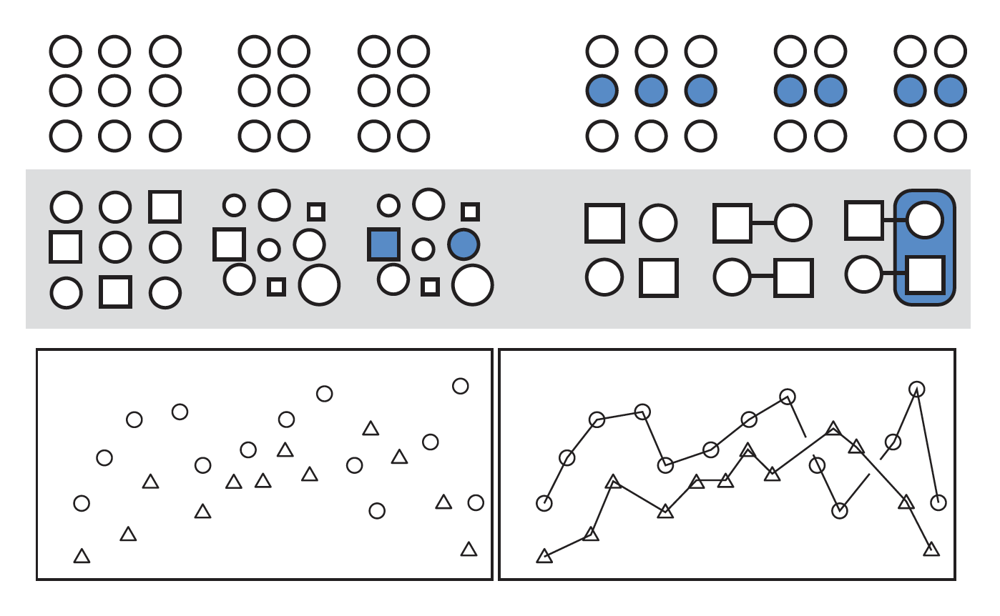

```{r setup, include=FALSE}
# don't mind this code chunk, it just sets up a few things for the rest
# it doesn't appear, because the include argument above is FALSE...
options(htmltools.dir.version = FALSE, servr.daemon = TRUE)
knitr::opts_chunk$set(cache=TRUE, autodep = TRUE, fig.retina = 3, message = FALSE, warning = FALSE)
old <- ggplot2::theme_set(iheiddown::theme_iheid())
```

```{r, load_refs, include=FALSE, cache=FALSE}
# Initializes the bibliography
library(RefManageR)
BibOptions(check.entries = FALSE,
           bib.style = "authoryear", # Bibliography style
           max.names = 3, # Max author names displayed in bibliography
           sorting = "nyt", #Name, year, title sorting
           cite.style = "authoryear", # citation style
           style = "markdown",
           hyperlink = FALSE,
           dashed = FALSE)
myBib <- ReadBib("assets/myBib.bib", check = FALSE)
# Note: don't forget to clear the knitr cache to account for changes in the
# bibliography.
```

---
class: split two

# What did we learn last week?

--

.pull-left[

Conceptually:

- Tidy datasets

- Wrangling data

- Functional Programming


]

--

.pull-right[

Practically:

```{r echo=TRUE, eval=FALSE}
# %>% the pipe operator
separate()
unite()
pivot_long()
pivot_wide()
select()
filter()
mutate()
group_by()
summarize()
count()
left_join() #family of functions to join datasets

```

]


---
class: split two

# Homework for today

.pull-left[

*Let's start by going through the homework together!*

- Common issues


- Any other general questions?

]

.pull.right[


]

---

class: split two


.pull-left[
## Lecture:

  - Principles of good visualization.
  - Grammar of Graphs (ggplot2).
  - Basic plots.
 
]

.pull-right[
## Practical:

  - Bar plots, line (and smoothed) plots, scatter (and jittered) plots, and box plots.
  - How to size, color, shape and label things.
  - How to facet plots.

]


---
#What makes good visualization?

--

- *Gestalt Principles*: sizes, colors, and shapes can structure a plot.

--

- *Tufte's Principle*: too much visual information makes comprehension more difficult.

--

##In other words:

- Leverage size, color, and shapes to...

- ...decrease unnecessary information while highlighting necessary information,

- **So one plot, tells one story clearly**.

---
## Gestalt principles (1/5)



- We look for structure... and we infer relationships from structure!

--

  - **Proximity**: things that are spatially near to one another seem related.
  
--

  - **Similarity**: things that look alike seem to be related.
  
--

  - **Connections**: things that are connected seem to be related.

--

.fifty[Image from and text adapted from: [Healy, 2018](https://socviz.co/)]
---
class: center middle

##  Gestalt principles: sizing things (2/5)


---
##  Gestalt principles: sizing things (3/5)

- Size, more than order, will define what is noticed first.
- Size things around and in your plot by their hierarchy of importance.

--


---
##  Gestalt principles: shapping and colouring things (4/5)


.fifty[Image from: [Kieran Healy](https://kieranhealy.org/blog/)]

---
##  Gestalt principles: shapping and colouring things (5/5)

.pull-left[

- Shape or color are good when you want to show contrast.

- Both together are often too much.
  - If you have color, shape, and two axis you are plotting 4 variables!

- Choose colors based on
  - the relationship: continuous or discrete?
  - intution: red for high temperatures, blue for low.

- *Remember: colorblindness is more frequent than you think!*

]

--

.pull-right[

```{r}
library(RColorBrewer)
display.brewer.all(colorblindFriendly = TRUE)
```


]

---
#Tufte's Law: Reduce data-to-ink ratio (1/4)


---
#Tufte's Law: Reduce data-to-ink ratio (2/4)


---
#Tufte's Law: Reduce data-to-ink ratio (3/4)


---
#Tufte's Law: Reduce data-to-ink ratio (4/4)


---
## Okay, but how do I know which plot is the best plot?


.fifty[From: [Data-to-Viz](https://www.data-to-viz.com/#explore)]

---
# How do I plot?

--
We will use a package called the [´{ggplot2}´](https://ggplot2.tidyverse.org/)


> ggplot2 is a system for declaratively creating graphics, based on **The Grammar of Graphics**. You provide the data, tell ggplot2 how to map variables to aesthetics, what graphical primitives to use, and it takes care of the details.

--

- Map variables to aesthetics: linking data do things you see.
- Graphical primitives: type of graph you want ( line, box, scatter...)

---
#ggplot2: Basic structure

```{r}

library(gapminder) #downloading the package with the data
library(dplyr) # loading dplyr
data("gapminder") # loading the data from the package
sample_n(gapminder,15) #showing a random sample

```

---
#ggplot2: Basic structure

.pull-left[

First, let's tell ggplot what data we have, and how to map variables to aesthetics.
  - Our data is gapminder.
  - Our x will be GDP per capita, our y life expectancy.
 
```{r}

library(ggplot2)
p<- ggplot(data=gapminder, mapping=aes(x=gdpPercap, y=lifeExp))

```

]

--

.pull-right[

```{r}
p
```
]


---
#ggplot2: Basic structure

.pull-left[

Second, let's tell ggplot2 what plot we want.
- We want a scatterplot, so we call `geom_point()`.
- We can just **add** the geom to the object p we created.
- In ggplot2 we add things, because we are **layering** rather than piping.
 
```{r}

p2<- p+ geom_point()

```

]

--

.pull-right[

```{r}
p2
```
]
---
#ggplot2: Basic structure

.pull-left[

There are multiple kinds of geom, you can check them in [´{ggplot2 Cheat Sheet}´](https://github.com/rstudio/cheatsheets/blob/main/data-visualization-2.1.pdf)
 
```{r}

p3<- p+ geom_boxplot()

```

]

--

.pull-right[

```{r}
p3
```
]
---
class:center middle with-logo

Made with `{iheiddown}`, the R-package for IHEID publications
`r Cite(myBib, "iheiddown")`.

---

# References

```{r refs, echo=FALSE, results="asis"}
RefManageR::PrintBibliography(myBib)
```
