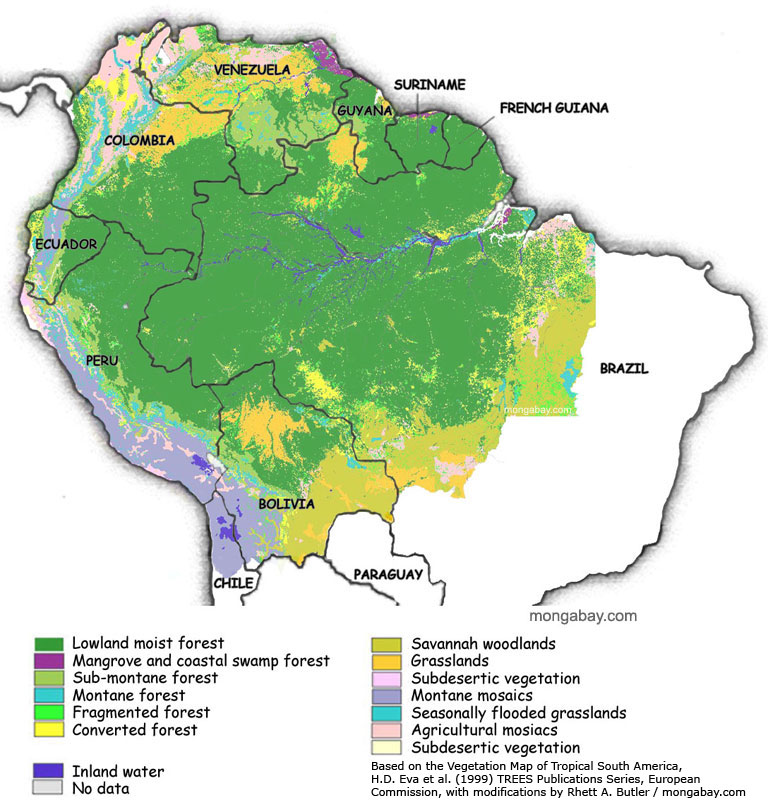
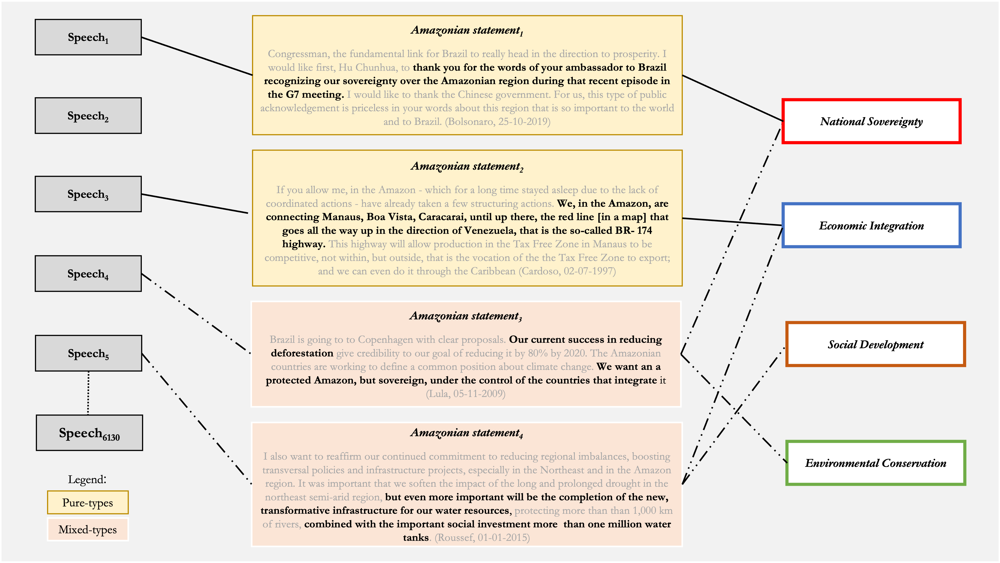

```{r setup, include=FALSE, message=FALSE, warning=FALSE}
knitr::opts_chunk$set(warning=FALSE, message = FALSE)
library(dplyr)
library(tidyr)
library(stargazer)
library(tibble)
library(ggplot2)
library(scales)
library(plm)
library(readxl)
options(stringsAsFactors = FALSE, scipen = 999)
```

*We need to protect the Amazon from foreign interests.*

*We need to exploit the Amazon's natural resources.*

*We need to provide better living standards for the people in the Amazon.*

*We need to preserve the Amazon as a standing ecosystem.*

```{r figure1, fig.cap="The Amazon Forest", out.width = '75%'}

```

\newpage

# Question

***How the Brazilian Amazon has been constructed as a problem in transnational presidential speeches since 1985?***

# Data and methods

- Dataset containing all 6130 official speeches by presidents since 1985

- Subset of 2014 “amazonian statements”

- Location

- Hand-coding and supervised machine learning

- Can you think of some limitations with this?

\newpage

\blandscape

```{r figure2, fig.cap="Operationalization of problem-constructions", out.width = '100%'}

```

\elandscape

\newpage

```{r data, include=FALSE}
#Load data
ama <- readRDS("final_data_as.Rds")
ama <- ama %>%
  select(-c(title, date, text, false_positives)) %>%
  rename (ei= "EI", sd= "SD")
AAI <- readRDS("AAI.Rds")
location_km <- read_excel("location_km.xlsx") %>%
  select(-location_cat) %>%
  distinct()
ama <- left_join(ama, location_km, by = "location")
amazon_def_year <- readRDS("amazon_def_year.Rds")
adr <- data.frame(year = c(1985, 1986, 1987), def_year = c(21.050, 21.050, 21.050))
#Missing year data
amazon_def_year <- rbind(adr, amazon_def_year) 
hp = data.frame(beg = c(1985, 1990, 1993, 1994, 2002, 2010, 2016, 2018),
                end = c(1990, 1993, 1994, 2002, 2010, 2016, 2018, 2022),
                label = c(1987, 1991, 1993, 1998, 2006, 2013, 2017, 2020),
                presid = c("Sarney", "Collor", "Franco", "Cardoso", "Lula",
                           "Rousseff", "Temer", "Bolsonaro"))
amazon_def_year$area <- amazon_def_year$def_year*1000
#Prepare data for problem-constructions
sov <- ama %>% 
  filter(sov==1) %>% 
  count(sov, year) %>%
  group_by(year) %>%
  select(-c(sov))%>%
  rename (sov = n)
ei <- ama %>% 
  filter(ei==1) %>% 
  count(ei, year) %>%
  group_by(year) %>%
  select(-c(ei))%>%
  rename (ei = n) %>%
  ungroup() %>%
  tibble::add_row(year = 2017, ei = 0) %>%
  tibble::add_row(year = 2018, ei = 0)
sd <- ama %>% 
  filter(sd==1) %>% 
  count(sd, year) %>%
  group_by(year) %>%
  select(-c(sd))%>%
  rename (sd = n)
con <- ama %>% 
  filter(con==1) %>% 
  count(con, year) %>%
  group_by(year) %>%
  select(-c(con))%>%
  rename (con = n)
other <- ama %>% 
  filter(other==1) %>% 
  count(other, year) %>%
  group_by(year) %>%
  select(-c(other))%>%
  rename (other = n)
temp <- ei %>% 
  left_join(other) %>% 
  left_join(con) %>% 
  left_join(sd) %>% 
  left_join(sov) %>% 
  replace(is.na(.), 0)
#Get mixed types in
ama_mx <-  ama %>%
  unite(mixed_type, sov:con, sep="_") %>%
  mutate(mx_cat = factor(case_when(mixed_type == '1_0_0_0' ~ "Pure National Sovereignty",
                                   mixed_type == '0_1_0_0' ~ "Pure Economic Integration", 
                                   mixed_type == '0_0_1_0' ~ "Pure Social Development",
                                   mixed_type == '0_0_0_1' ~ "Pure Environmental Conservation",
                                   mixed_type == '0_0_0_0' ~ "Other",
                                   mixed_type == '0_1_0_1' ~ "Economic Conservation",
                                   mixed_type == '0_1_1_0' ~ "Social Economic",
                                   mixed_type == '1_0_0_1' ~ "Sovereign Conservation",
                                   mixed_type == '0_1_1_1' ~ "Economic, Social,\nand Conservation",
                                   mixed_type == '1_1_0_0' ~ "Economic Sovereignty",
                                   mixed_type == '0_0_1_1' ~ "Social Conservation",
                                   grepl("1_0_1_0|1_0_1_0|1_0_1_1|1_1_0_1|1_1_1_0|1_1_1_1",
                                         mixed_type) ~ "Other Mixed-types"),
         levels = c("Pure Economic Integration", "Pure Environmental Conservation",
                    "Pure Social Development",
                    "Pure National Sovereignty", "Other", "Economic Conservation", 
                    "Social Economic", "Sovereign Conservation",
                    "Economic, Social,\nand Conservation",
                    "Economic Sovereignty", "Social Conservation", "Other Mixed-types")),
         mx_cat2 = case_when(grepl("Pure Economic Integration|Pure Environmental Conservation|
                                   |Pure Social Development|Pure National Sovereignty",
                                   mx_cat) ~ "Pure-types",
                             grepl("^Other$", mx_cat) ~ "Other",
                             grepl("Economic Conservation|Social Economic|Sovereign Conservation|
                                   |Economic, Social,\nand Conservation|Economic Sovereignty|
                                   |Social Conservation|Other Mixed-types",
                                   mx_cat) ~ "Mixed-types"),
         election_year = ifelse(grepl("1989|1994|1998|2002|2006|2010|2014|2018",
                                      year), 1, 0),
                  location_cat = ifelse(grepl("parana|paraiba|mato grosso|mato grosso do sul",
                                     location, ignore.case = TRUE), #minor coding issues to fix
                               "Non Amazonian States", location_cat),
         location_cat = ifelse(grepl("paraguay", location, ignore.case = TRUE),
                               "International", location_cat), #minor coding issues to fix
         location_cat = factor(ifelse(grepl("Bolivia|Peru|Ecuador|Colombia|Venezuela|Guyana|Suriname",
                                            location), "Amazonian Countries", location_cat),
                               levels = c("International", "Amazonian States",
                                          "Amazonian Countries", "Brasilia",
                                          "Non Amazonian States")))
```

# A simple logistic regression

Why do we use a logistic model and not a linear one [here](https://stackoverflow.com/questions/12146914/what-is-the-difference-between-linear-regression-and-logistic-regression)?

```{r logistic}
ama_model <- dplyr::left_join(ama_mx, amazon_def_year, by = "year") #merge
ama_model <- dplyr::left_join(ama_model, AAI, by = "year") #merge
ama_model <- filter(ama_model, location_cat != "Non Identified",
                    mx_cat != "Other Mixed-types") %>%
  mutate(con_vs_all = ifelse(mx_cat == "Pure Environmental Conservation", 1, 0),
         EI_vs_all = ifelse(mx_cat == "Pure Economic Integration", 1, 0),
         SD_vs_all = ifelse(mx_cat == "Pure Social Development", 1, 0),
         sov_vs_all = ifelse(mx_cat == "Pure National Sovereignty", 1, 0))
#model
model_logit_con <- glm(con_vs_all ~ km_to_manaus + election_year + def_year + AAI,
                   family=binomial(link = "logit"), data = ama_model)
summary(model_logit_con)
```

\newpage

*[Need an easy publication table?](https://rpubs.com/omerorsun/week3_stargazer)*

```{r table 1, results="asis"}
con_model <- stargazer::stargazer(model_logit_con, header = FALSE)
```

*[What are log-odds](https://towardsdatascience.com/https-towardsdatascience-com-what-and-why-of-log-odds-64ba988bf704)*

# What about [time effects](https://www.researchgate.net/post/Which_should_I_choose_Pooled_OLS_FEM_or_REM)?

Does time matter?

```{r fixed effects}
ols <- plm::plm(con_vs_all ~ km_to_manaus + election_year + def_year + AAI,
                data = ama_model, model = "pooling", index = c("year"))
fixed <- plm::plm(con_vs_all ~ km_to_manaus + election_year + def_year + AAI,
                data = ama_model, model = "within", index = c("year"))
random <- plm::plm(con_vs_all ~ km_to_manaus + election_year + def_year + AAI,
                   data = ama_model, model = "random", index = c("year"))
summary(ols)
summary(fixed)
summary(random) 
```

\newpage

# The Amazon multi-level game: talking to the people inside

Can you see the relationship?

```{r Figure 3, fig.cap="Logistic Regression predicted values"}
# other models
model_logit_ei <- glm(EI_vs_all ~ km_to_manaus + election_year + def_year + AAI,
                   family=binomial(link = "logit"), data = ama_model)
model_logit_sd <- glm(SD_vs_all ~ km_to_manaus + election_year + def_year + AAI,
                   family=binomial(link = "logit"), data = ama_model)
model_logit_sov <- glm(sov_vs_all ~ km_to_manaus + election_year + def_year + AAI,
                   family=binomial(link = "logit"), data = ama_model)
#Plot model
ama_model$"Environmental Conservation" = predict(model_logit_con, ama_model, type = "response")
ama_model$"Economic Integration" = predict(model_logit_ei, ama_model, type = "response")
ama_model$"Social Development" = predict(model_logit_sd, ama_model, type = "response")
ama_model$"National Sovereignty" = predict(model_logit_sov, ama_model, type = "response")
plot_loc <- ama_model %>% gather(key=p_c, value = pred, 22:25)
plot_loc$p_c <-factor(plot_loc$p_c, levels = c("Economic Integration",
                                               "Environmental Conservation",
                                               "Social Development",
                                               "National Sovereignty"))
ggplot(plot_loc, aes(x = km_to_manaus, y=pred, color=p_c)) +
  geom_jitter(alpha=1, size=1) +
  geom_smooth(size = .5, se=FALSE) +
  scale_y_continuous(labels = percent_format()) +
  labs(x = "Distance from the Amazon (km)",
       y = "",
       title = "Predicted probability of each problem-construction as a function of distance from the Amazon",
       caption = "Curves in the plots are estimated using loess method.") +
  theme(text = element_text(size=11,  family="Times"),
        panel.background = element_rect("white", "black", .5, "solid"),
                  panel.grid.major = element_line(color = "grey", linewidth = 0.2,
                                                  linetype = "solid"),
        axis.text = element_text(color = "black", size = 11),
        title = element_text(color = "black", size = 12, face = "bold"),
        legend.title = element_blank(),
        plot.subtitle = element_text(color = "black", size = 11, face = "plain"),
        legend.position = "none") +
  facet_wrap(~p_c, ncol=2)
```

\newpage

\blandscape

# The Amazon multi-level game: boasting policy outside

Why should we divide distances to Manaus?

```{r Table 2, fig.cap="Logistic Regressions Output", results="asis"}
ama_model$thousand_km<- ama_model$km_to_manaus/1000
model_logit_con2 <- glm(con_vs_all ~ thousand_km + election_year + def_year + AAI,
                   family=binomial(link = "logit"), data = ama_model)
model_logit_ei2 <- glm(EI_vs_all ~ thousand_km + election_year + def_year + AAI,
                   family=binomial(link = "logit"), data = ama_model)
model_logit_sd2 <- glm(SD_vs_all ~ thousand_km + election_year + def_year + AAI,
                   family=binomial(link = "logit"), data = ama_model)
model_logit_sov2 <- glm(sov_vs_all ~ thousand_km + election_year + def_year + AAI,
                   family=binomial(link = "logit"), data = ama_model)
md <- stargazer::stargazer(model_logit_con2, model_logit_ei2, model_logit_sd2,
                          model_logit_sov2, digits = 6, header = FALSE,
                          dep.var.labels = c("Conservation", "Economic Integration",
                                             "Social Development", "Sovereignty"),
                          covariate.labels = c("Distance from the Amazon in 1000s of km",
                                               "Election year", "Yearly Deforestation",
                                               "Yearly   Inflation"), no.space = TRUE,
                          title = "Logistic Regression Models")
```

\elandscape

```{r proportion, eval=FALSE, include=FALSE}
## Not a big fan of log odds, nobody is...
library(sjPlot)
sjPlot::tab_model(model_logit_con2, model_logit_ei2,
                  model_logit_sd2,model_logit_sov2)
```
